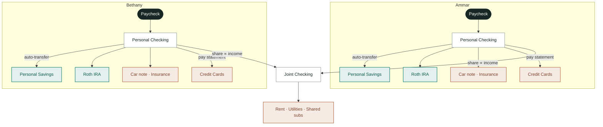

# Money Man

A shared monthly money snapshot for two. Income in, fixed costs out, one card
balance per statement cycle — and a clear headline: how much you saved and
invested this month.

Not a budgeting app. No transaction imports, no category-by-category logging.

## Stack

- React + Vite + TypeScript
- Tailwind CSS
- Recharts
- Supabase (Postgres + Auth)
- Netlify (hosting)

## Run locally

```bash
npm install
npm run dev
```

With no env vars set, the app runs in **demo mode**: you're signed in
automatically and see realistic seed data (persisted in localStorage) so you
can explore every screen. Connect Supabase to go live.

## Connect Supabase (go live)

1. Create a free project at [supabase.com](https://supabase.com).
2. Open **SQL Editor**, paste the contents of `supabase/schema.sql`, and run it.
   This creates the five tables, unique constraints, and RLS policies.
3. **Authentication > Users > Add user**: create ONE shared email/password user
   for the household (set the password directly). Then under
   **Authentication > Sign In / Up**, disable public sign-ups.
4. Copy `.env.example` to `.env` and fill in from
   **Project Settings > API**:
   - `VITE_SUPABASE_URL`
   - `VITE_SUPABASE_ANON_KEY`
5. Restart `npm run dev` and sign in with the shared credentials.

### Migrating an existing database

If you created the database before these updates, run the migrations in order
in the Supabase SQL Editor. Both are safe on live data — no rows are deleted:

```sql
-- supabase/migrations/001_card_statements_unique.sql
--   Enforces card-statement uniqueness (prevents double-counting spend);
--   deduplicates existing rows first, keeping the newest per card/date.

-- supabase/migrations/002_wealth_kinds.sql
--   Widens fixed_items.kind from expense/investment to
--   expense/saving/investment/retirement. Existing rows keep working;
--   afterwards, edit items in Manage to reclassify (e.g. Roth IRA → Retire).
```

## Deploy to Netlify

1. Push this repo to GitHub.
2. In Netlify: **Add new site > Import an existing project**, pick the repo.
   Build settings are read from `netlify.toml` (build `npm run build`,
   publish `dist`).
3. Add the two `VITE_SUPABASE_*` environment variables under
   **Site configuration > Environment variables**.
4. Deploy, then open the site on your phones and sign in.

## How money flows

Open **How money flows** in the app (`/flow`) for a live diagram of accounts and
arrows. Teal = wealth-building (what the hero number counts). Orange = spending.
Joint contributions scale with each partner's income.



## How the numbers work

- Everything is normalized to monthly: biweekly × 26⁄12, annual ÷ 12.
- Joint costs are split **proportionally to each partner's income**, recomputed
  live from entered income — not a hardcoded 50/50.
- Wealth-building fixed items come in three kinds, each tracked separately on
  the dashboard: **Saving** (HYSA, emergency fund), **Investment** (brokerage),
  and **Retirement** (Roth IRA, 401(k)). Paycheck auto-savings transfers count
  as Saving. Together they make up planned contributions — never expenses.
- Card statements count toward the month their closing date falls in.
- "Other spend" is debit/cash that didn't hit a tracked card. You can add
  multiple entries per month; an optional label notes what each was for.
- One-time income counts in the month it was entered.

### Hero number: Net wealth this month

The hero shows **net wealth change** — what your household actually got richer by:

```
netWealthChange = plannedWealth − savingsDraw

plannedWealth = totalSaving + totalInvesting + totalRetirement
savingsDraw   = max(0, −netLeftover)   // pulls from savings when overspent
netLeftover   = income − spending − plannedWealth
```

- Roth IRA and brokerage contributions count as fully met (they're automated).
- If spending exceeds income, the shortfall is drawn from cash savings. The hero
  dips to reflect reality while retirement stays funded.
- A positive leftover stays in checking — unallocated cash is not added to the hero.
- If `netWealthChange` goes negative (draw exceeds the savings contribution), the
  hero turns red.

### Monthly guidelines

The dashboard shows income-based targets as a reference. These are not enforced —
they're a "pay yourself first" benchmark to check against at a glance.

| Bucket | Target | What's compared |
|--------|--------|-----------------|
| Retirement | 15% | Roth IRA + 401(k) contributions |
| Cash savings | 10% | Effective saving after any draw |
| Investing | 5% | Brokerage / taxable investing |
| Fixed living | ≤50% | Rent, bills, insurance, car note |
| Flexible spend | ≤20% | Net card spend + cash/debit |

The flexible-spend legend (groceries ~10%, dining+entertainment ~5%, gas ~5%)
is a mental guide only — the app does not break down card spend by category.

## Which number do I enter for a card statement?

Enter **New Charges** — the total of purchases, fees, and interest for that
cycle. **Not** the "New Balance" printed at the top of the statement.

| Statement field | Enter it? | Why |
|---|---|---|
| Purchases / New charges | ✅ Yes, this is it | Measures what you actually spent |
| Fees & interest | ✅ Add to purchases | Real cost of using the card |
| New Balance | ❌ No | Distorted by payment timing and carried balances |
| Minimum Payment Due | ❌ No | Arbitrary minimum, not actual spend |
| Payments & Credits | ❌ No | What you sent to the card, not what you spent |

**Can't find the Purchases line?** Use the built-in statement calculator
(tap "Find it from my statement" in the card form). Enter New Balance,
Previous Balance, and Payments & Credits — it computes purchases for you:

```
New Charges = New Balance − Previous Balance + Payments & Credits
```

### Edge cases

- **Paid in full before closing date** → New Balance may show $0, but your
  Purchases line still reflects actual spend. Use the calculator.
- **Carried balance from last month** → Still enter only this cycle's
  Purchases. Carried debt was already counted in a prior month.
- **Refund-heavy cycle** → Negative values are allowed. The net is clamped
  to zero in the monthly totals (a refund doesn't reduce your other spending).
- **Fixed bill on a card (e.g. insurance autopay)** → Set "Paid with" on the
  fixed item to that card. The app nets it out of the statement total so
  the bill isn't counted twice — once as a fixed item and again in the
  statement. The fixed item remains the authoritative source for that
  bill's amount every month.
- **Annual bill (e.g. $1,200 insurance in January)** → The full charge lands
  in January's statement. The app nets out 1/12 ($100) each month as a
  fixed-item overlap. In January that means $100 is netted while $1,100
  shows as card spend — this is intentional; the annual amount is still
  tracked correctly in the Insurance category across all months.

## Local verification

```bash
npm run verify    # sanity-checks the summary math against hand-computed values
npm run build     # TypeScript compile + production bundle
npm run lint      # lint the source
```

## Project structure

```
src/
  components/   UI building blocks (dashboard cards, charts, manage forms)
  hooks/        Auth, household data context, useMonthlySummary
  lib/          Supabase client, data API (live + demo), money math, summaries
  pages/        Login, Dashboard, ManageData
  types/        Database row types
supabase/       schema.sql — run in the Supabase SQL editor
```
